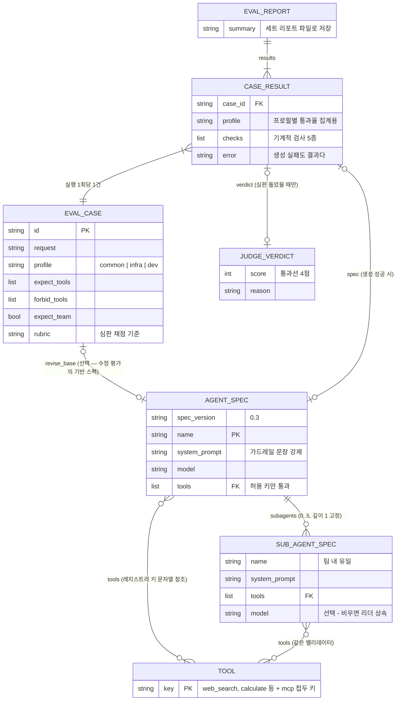
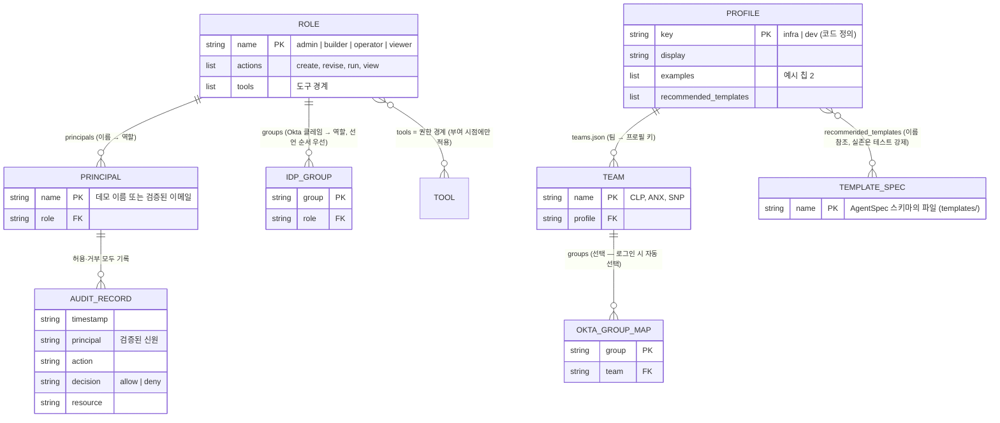
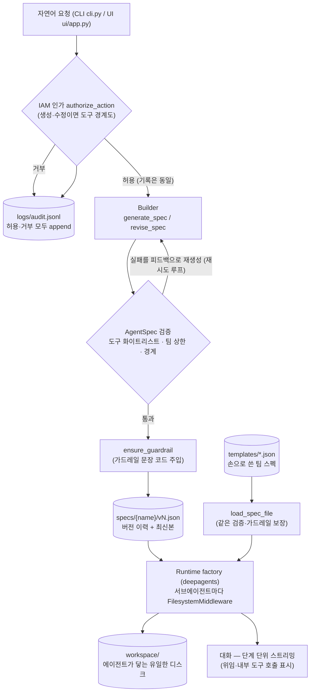
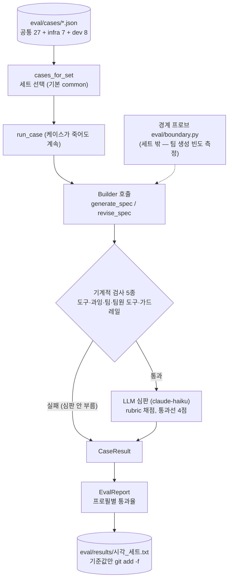

# 아키텍처 — 스키마 관계도와 데이터흐름

> 작성일: 2026-10-01 · 레이어 설명은 [CLAUDE.md](../CLAUDE.md), 결정 배경은 [BUILD_SPEC.md](../BUILD_SPEC.md)

## 1. 스키마 관계도 (ERD 대체)

**이 시스템에는 데이터베이스가 없다.** 모든 영속 데이터는 파일(JSON·JSONL·txt)이고
스키마는 Pydantic 모델·dataclass가 정의한다. 따라서 아래는 테이블 ERD가 아니라
**스키마 관계도**다 — 핵심 필드와 관계(카디널리티)만 그리고, 전체 필드는 소스로
연결한다.

| 스키마 | 소스 | 저장 위치 |
|---|---|---|
| AgentSpec · SubAgentSpec | [runtime/spec.py](../runtime/spec.py) | `specs/<name>/vN.json` (이력) + `templates/*.json` (손으로 쓴 것) |
| 도구 레지스트리 | [registry/](../registry/) | 코드 (파일 아님 — 화이트리스트의 단일 진실 원천) |
| EvalCase | [eval/dataset.py](../eval/dataset.py) | `eval/cases/*.json` |
| CaseResult · EvalReport | [eval/runner.py](../eval/runner.py) | 실행 중 메모리, 텍스트 리포트로 `eval/results/<시각>_<세트>.txt` |
| BoundaryProbe | [eval/boundary.py](../eval/boundary.py) | 코드 (측정 이력은 observed 필드) |
| Role · Principal · IamConfig | [runtime/iam.py](../runtime/iam.py) | `iam.json` (없으면 내장 기본 정책) |
| 감사 레코드 | [runtime/iam.py](../runtime/iam.py) `_write_audit` | `logs/audit.jsonl` (append-only) |
| Profile · TeamsConfig | [runtime/teams.py](../runtime/teams.py) | 프로필은 코드, 팀 매핑은 `teams.json`(없으면 `teams.example.json`) |

### 1-1. 명세와 평가

### 1-2. 설정(IAM·팀)과 감사 로그

주: `PROFILE`은 파일이 아니라 코드(`runtime/teams.py`)에 정의된다 — 팀은 권한과
**별개의 축**이라 `ROLE`과 `PROFILE` 사이에는 관계선이 없다. 이것이 의도다.

## 2. 데이터흐름도

### 2-1. 메인 경로 — 자연어 요청에서 대화·감사 로그까지

### 2-2. 평가 경로 (별도)

흐름의 불변식 — 어느 진입점(CLI·UI·템플릿·평가)이든 **같은 검증·같은 가드레일**을
받는다(`load_spec_file` 공용화), 인가 판정은 **허용·거부 모두** 감사 로그에 남는다,
Builder 재시도 루프에는 검증 실패와 경계 위반이 **같은 피드백 형식**으로 들어간다.
