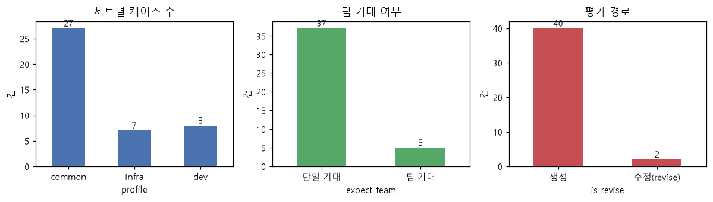
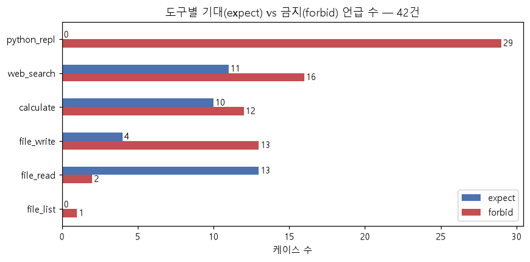
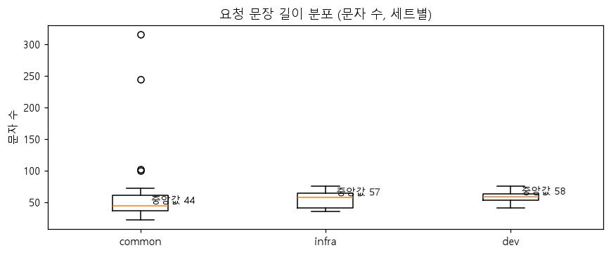
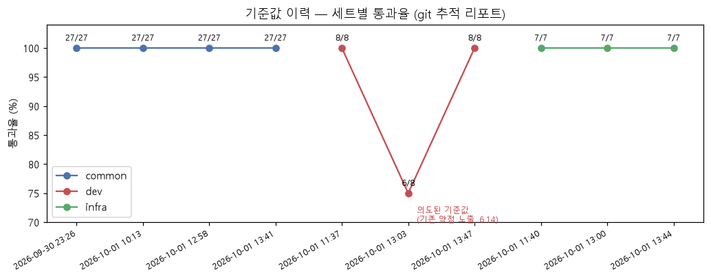
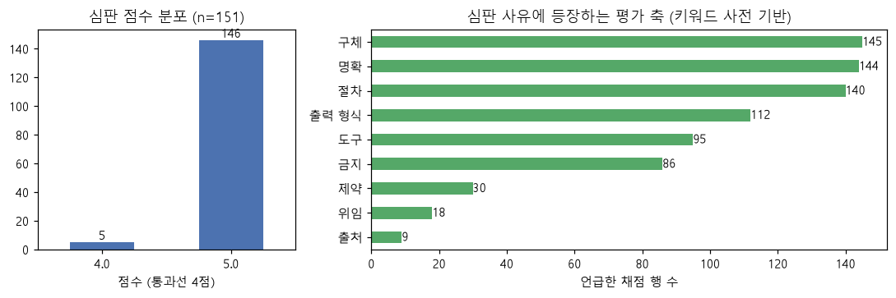
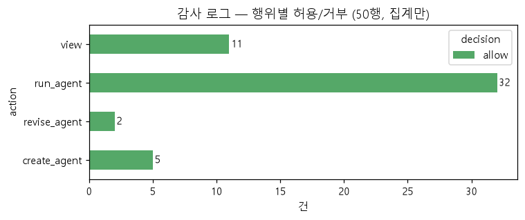

# EDA 보고서 — 평가 케이스·기준값 리포트

> 작성일: 2026-10-01 · 집계 로직과 수치의 원천: [notebooks/eda.ipynb](../notebooks/eda.ipynb)
> (LLM 호출 없음 — `pip install -r requirements-eda.txt` 후 전체 재실행 가능.
> 입력은 레포에 커밋된 파일만: 케이스 42건 + git 추적 기준값 리포트 10개.
> 감사 로그 절만 로컬 파일을 쓰며 clone에서는 자동 생략된다.)

범위: **A** 평가 케이스 42건 + **B** 기준값 리포트 이력 중심, **C** 감사 로그 구조
시연(집계값만), **E** 부록. 비용 실측은 제외 — [REPORT.md](../REPORT.md) 7.4의
문서 기록 수치(222건 $4.44, 출력이 비용의 61% 등)만 인용한다.

## 0. 데이터 수집·정제 과정 (요약)

이 데이터는 수집한 것이 아니라 **실측으로 만든** 것이다 — 과정이 품질 통제다.

1. **기대값 고정**: 후보 요구를 먼저 적고 → Builder에 실제로 던지고 → 어긋난
   것만 고정 (추측 금지)
2. **확장 이력**: 9 → 12(보안 결함 1 적발) → 21(평가 스위트 자체 결함 4) →
   27(수정 revise 경로 개봉) → **42**(프로필 infra 7·dev 8, 기존 27건 무수정)
3. **케이스 결함 수정**: 케이스도 채점 대상이다 — forbid 누락 2건(심판이 적발),
   팀 판단 경계 문구 1건. 사유는 케이스 파일 `_note`에 보존
4. **흔들리는 입력 분리**: 간헐 변동 문구는 세트에 넣지 않고
   `eval/boundary.py` 프로브로 — 통과/실패 대신 **빈도**
5. **스키마 검증**: Pydantic이 id 패턴·profile·revise_base·중복을 **로드
   시점에** 검증 — 깨진 케이스는 LLM 호출 전에 실패한다

## A. 평가 케이스 42건

- 세트: **common 27 · infra 7 · dev 8**. 팀 기대 **5건(12%)** — "기본값은 단일"
  설계가 기대값 분포에도 반영돼 있다. 수정(revise) 경로 2건.

- **python_repl: expect 0 · forbid 29** — 스위트에서 가장 많이 금지되는 도구다.
  스위트의 상당 부분이 "임의 코드 실행을 과잉 부여하지 않는가"를 감시한다는 뜻
  (6.15에서 이 감시망이 실제로 결함을 잡았다).
- expect 1위는 **file_read(13)** — ADFS 도메인 추가 이후 "작업공간 파일 기반
  분석"이 요구의 중심축이 됐다. web_search(11)·calculate(10)가 뒤를 잇는다.
- file_write는 expect 4 vs forbid 13 — "읽기만 허용" 류의 부분 부정 요구가 많다.

- 요청 문장 길이는 세트 간 큰 차이가 없다 — 프로필 케이스가 특별히 길거나
  장황하지 않게 설계됐다 (중앙값은 차트 주석 참조).

## B. 기준값 리포트 이력 (git 추적 10개)

- common 4회 전부 **27/27**, infra 3회 전부 **7/7**. dev는 **8/8 → 6/8 → 8/8** —
  가운데 6/8은 회귀 실패를 그대로 남긴 **의도된 기준값**이다(수정과 무관한 기존
  약점 노출, REPORT 6.14). 마지막 8/8은 원인(프롬프트) 수정 후의 실행이다(6.15).

- 심판 채점 **151행** 중 5점 146 · **4점 5건(3.3%)**, 3점 이하 0 — 기준값
  리포트는 통과본이므로 당연히 상위에 몰려 있다 (실패 적발 사례는 기준값이 아니라
  REPORT 6절에 있다). 4점 5건의 사유는 모두 "요구는 충족, 세부 구체화 여지"
  패턴 — 예: `revise_adds_a_tool`은 두 시점 모두 "파일 이름 형식·저장 위치
  구체화"로 1점을 잃었다 (반복되는 감점 = 프롬프트 개선 후보).
- 심판 사유 키워드(사전 기반): **구체(145)·명확(144)·절차(140)·출력 형식(112)**
  순 — 심판이 실제로 보는 축이 rubric 설계(절차·형식·제약 명시)와 일치한다.

## C. 감사 로그 — 구조 시연 (로컬 50행, 집계값만)

> 개인정보 보호: principal에 검증된 이메일이 들어갈 수 있어 **원문 행은 싣지
> 않는다**. 필드 구조와 집계만 기록한다. (gitignore 대상이라 clone에는 없다.)

- 필드: `timestamp, principal, role, action, decision, resource, detail, pid`
- 로컬 50행 · 주체 4종: run_agent 32 · view 11 · create_agent 5 · revise_agent 2,
  **전부 allow(deny 0)** — 현 로컬 로그가 admin 중심 데모 실행의 기록이라서다.
  거부 기록 경로(미등록 주체·경계 위반·매핑 없는 신원)는 테스트와 Okta 실검증에서
  별도로 확인돼 있다.

## E. 부록 — 개선 실험·경계 프로브

- 개선 실험 9건: **개선 8 · 미검출 1**, 그중 단일 실행 판정(근거 약함) 3건 —
  반복 측정 관행은 6.11 이후 생겼다. 상세: [EVAL_COMPARISON.md](EVAL_COMPARISON.md)
- 경계 프로브 4종(세트 밖): 발견 원문만 팀 생성이 관찰됐고(수정 전 합산 2/8,
  최종 1/5), 신규 일반화 문구 3종은 전 구간 0/5

## 한계

- 기준값 리포트는 10개(세트당 3~4개) — 추이는 굵은 방향만 읽어야 한다
- 심판 사유 키워드는 사전 기반 부분 문자열 매칭이다(형태소 분석 아님)
- 감사 로그는 개발 로컬의 기록이라 운영 분포를 대표하지 않는다
